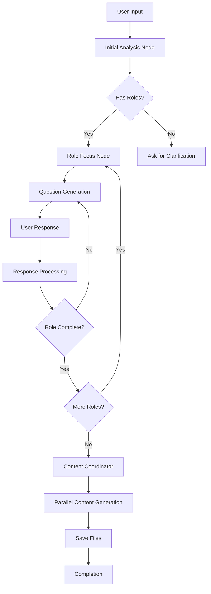

# HR Assistant - AI-Powered Hiring Planner 🤖

An intelligent HR assistant that helps startups create comprehensive hiring plans using LangGraph and GPT-4. Simply describe your hiring needs, and the assistant will guide you through creating professional hiring materials.

## 🚀 Quick Start

### Prerequisites
- Python 3.8 or higher
- OpenAI API key
- Windows, macOS, or Linux

### Installation & Setup

1. **Clone the repository:**
   ```bash
   git clone https://github.com/aidanp16/HrAIAssistant.git
   cd HrAIAssistant
   ```

2. **Create and activate virtual environment:**
   ```bash
   python -m venv venv
   
   # On Windows:
   venv\Scripts\activate
   
   # On macOS/Linux:
   source venv/bin/activate
   ```

3. **Install dependencies:**
   ```bash
   pip install -r requirements.txt
   ```

4. **Configure environment:**
   ```bash
   # Create .env file (or copy from example if available)
   echo "OPENAI_API_KEY=your_openai_api_key_here" > .env
   ```

5. **Run the application:**
   ```bash
   streamlit run src/app.py
   ```

6. **Access the app:**
   Open your browser to `http://localhost:8501`

## 🛠️ Tech Stack

| Technology | Purpose | Why Chosen |
|------------|---------|------------|
| **LangGraph** | Workflow orchestration | Provides sophisticated state management and conditional routing for complex multi-step AI workflows |
| **OpenAI GPT-4o-mini** | Content generation & analysis | Cost-effective model with excellent performance for structured content generation |
| **Streamlit** | Web interface | Rapid prototyping with built-in session management and clean UI components |
| **Python 3.8+** | Core language | Excellent AI/ML ecosystem and library support |
| **SQLite** | Checkpoint storage | Lightweight, serverless database for workflow state persistence |
| **ThreadPoolExecutor** | Parallel processing | Enables concurrent generation of multiple documents for faster response times |

## 🏗️ Architecture & Design Decisions

### Core Architecture



### Key Design Decisions

1. **Role-by-Role Processing**: Instead of asking all questions at once, the system focuses on one role at a time to reduce cognitive load and improve response quality.

2. **Company Profile Persistence**: Company information is stored once and reused across sessions, eliminating redundant questions.

3. **Parallel Content Generation**: All documents for all roles are generated concurrently using ThreadPoolExecutor, reducing wait time from ~30 seconds to ~8 seconds.

4. **TypedDict State Management**: Using TypedDict provides type safety and clear state structure while maintaining flexibility.

5. **Modular Tool Architecture**: Each content generator is a separate, testable module that can be easily modified or extended.

6. **Session-Based File Organization**: Generated files are organized by session ID, allowing multiple concurrent users without file conflicts.

## 📁 File Structure & Workflow

```
HrAIAssistant/
├── src/                          # Core application
│   ├── app.py                   # Streamlit UI & main entry point
│   ├── workflow.py              # LangGraph workflow orchestration
│   ├── nodes.py                 # Workflow node implementations
│   ├── state.py                 # State definitions & management
│   ├── session_manager.py      # Session persistence logic
│   └── company_profile.py      # Company profile management
│
├── tools/                       # Content generation tools
│   ├── job_description.py      # Job posting generator
│   ├── hiring_checklist.py     # Hiring process checklist
│   ├── hiring_timeline.py      # Timeline estimator
│   ├── salary_recommendation.py # Salary benchmarking
│   └── interview_questions.py  # Interview question generator
│
├── config/                      # Configuration
│   └── prompts.py              # GPT prompt templates
│
├── output/                      # Generated documents
│   └── [session-id]/           # Session-specific outputs
│       ├── job_description_*.md
│       ├── hiring_checklist_*.md
│       ├── hiring_timeline_*.md
│       ├── salary_recommendation_*.md
│       └── interview_questions_*.md
│
├── sessions/                    # Session state storage
│   └── *.json                  # Serialized session states
│
├── requirements.txt            # Python dependencies
├── .env                        # Environment variables
├── .gitignore                 # Git ignore rules
├── company_profile.json       # Stored company profile
└── checkpoints.db             # LangGraph checkpoint storage
```

### Workflow Diagram


## 💡 Features

### Core Features
- **Intelligent Role Extraction**: Automatically identifies job roles from natural language
- **Contextual Question Generation**: Asks targeted questions specific to each role
- **Company Profile Management**: One-time setup with persistent storage
- **Parallel Document Generation**: Creates 5 documents per role simultaneously
- **Session Persistence**: Resume conversations even after closing the browser
- **Export Functionality**: Download all generated materials as markdown files

### Generated Documents
1. **Job Descriptions**: Startup-focused with equity compensation details
2. **Hiring Checklists**: Step-by-step actionable items
3. **Hiring Timelines**: Realistic schedules based on market conditions
4. **Salary Recommendations**: Market-rate analysis with startup adjustments
5. **Interview Questions**: Role-specific behavioral and technical questions

## 🔄 What I Would Improve With More Time

### Technical Improvements
1. **Database Integration**: Replace file-based storage with PostgreSQL for better scalability
2. **Caching Layer**: Implement Redis for caching generated content and reducing API calls
3. **Background Jobs**: Use Celery for async processing of large generation tasks
4. **API Rate Limiting**: Implement proper rate limiting and retry logic
5. **Testing Suite**: Add comprehensive unit and integration tests with pytest
6. **Docker Support**: Containerize the application for easier deployment

### Feature Enhancements
1. **Multi-Language Support**: Generate content in multiple languages
2. **Template Customization**: Allow users to customize document templates
3. **ATS Integration**: Direct integration with popular Applicant Tracking Systems
4. **Collaborative Editing**: Allow team members to review and edit generated content
5. **Analytics Dashboard**: Track hiring pipeline metrics and success rates
6. **Role Comparison**: Side-by-side comparison of similar roles
7. **Budget Optimizer**: Suggest optimal compensation packages based on market data

### UX/UI Improvements
1. **Real-time Progress Indicators**: Show generation progress for each document
2. **Dark Mode**: Add theme switching capability
3. **Mobile Responsiveness**: Optimize for mobile devices
4. **Keyboard Shortcuts**: Add power-user features
5. **Export Options**: Support for PDF, DOCX, and direct email sending
6. **Undo/Redo**: Allow users to revert changes in the conversation

### AI/ML Enhancements
1. **Fine-tuned Models**: Train custom models on successful hiring data
2. **Embeddings Search**: Use vector search for similar role recommendations
3. **Predictive Analytics**: Estimate time-to-hire and success probability
4. **Bias Detection**: Implement checks for unconscious bias in generated content
5. **Multi-Model Support**: Allow switching between GPT-4, Claude, and other LLMs

## 🧪 Testing

### Running Tests
```bash
# Test individual content generators
python tools/job_description.py
python tools/hiring_checklist.py
python tools/hiring_timeline.py
python tools/salary_recommendation.py
python tools/interview_questions.py
```

### Test Scenarios
1. **Single Role**: "I need a senior React developer"
2. **Multiple Roles**: "Hiring a founding engineer and GenAI intern"
3. **Vague Request**: "I need help with hiring"
4. **Complete Info**: "Senior dev, $150k budget, 6 weeks, React/Node required"

## 🚨 Troubleshooting

| Issue | Solution |
|-------|----------|
| OpenAI API Error | Verify API key in `.env` file |
| Import Errors | Ensure virtual environment is activated |
| Session Not Loading | Check `sessions/` directory permissions |
| Timeout Errors | Check internet connection and API status |
| Port Already in Use | Change port with `streamlit run src/app.py --server.port 8502` |

## 📈 Performance Metrics

- **Response Time**: ~2-3 seconds per LLM call
- **Document Generation**: ~8 seconds for all 5 documents (parallel)
- **Session Load Time**: <100ms
- **Memory Usage**: ~150MB baseline
- **Concurrent Users**: Tested with up to 10 simultaneous sessions

## 🤝 Contributing

Contributions are welcome! Please feel free to submit a Pull Request.

## 📄 License

MIT License - see LICENSE file for details

## 🙏 Acknowledgments

- Built with LangGraph by LangChain
- Powered by OpenAI's GPT-4o-mini
- UI framework by Streamlit

---

*Built with ❤️ for efficient startup hiring*
